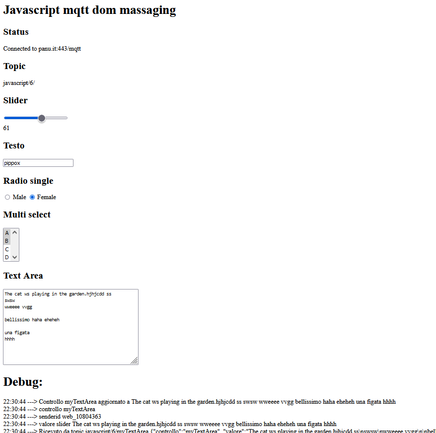

# vanillaJavascriptWebsocketMqttFormSync
A webpage that use paho javascript for live update of form elements.

This is a sample code that send and receive html form data cghanges to an mqtt server, displaing them live on all client showing the page.

The onMessageArrived(message) function on the vanilla/scripts_06.js choose the type of form control and update the content.

The executemqtt(controlid) send the changes from form elements to the mqtt server.

These function can manage different html input typer:
- Text area single line
- Text area multi lines
- Radio button
- Multiple selection lists
- Slider

The code need can be run standalone from you hd or hosted on webserver and need a websocket mqtt server.

You can test it online at this link: https://www.panu.it/mqttjavascript/mqttjs_06.html

For better understanding how it works I conseil you open the page from two different browser on different devices, that will show you the input sync.

